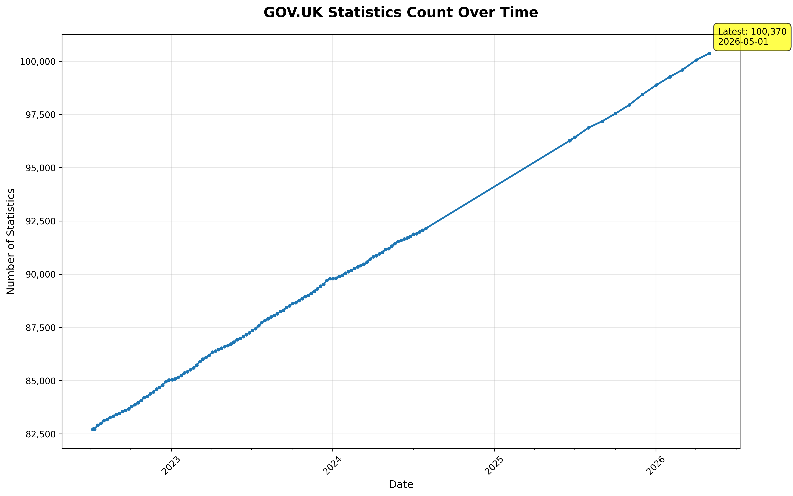

# GOV.UK Statistics Counter

A containerized Python application that automatically tracks the number of statistics published on GOV.UK over time.

## 📊 Current Status

- **Latest Count**: 96,281+ statistics (as of June 2025)
- **Data Collection**: Automated monthly via GitHub Actions
- **Status**: ✅ Fully operational

## 🔍 What it does

This application:
- Scrapes the [GOV.UK research and statistics search page](https://www.gov.uk/search/research-and-statistics)
- Extracts the total count of published statistics
- Logs timestamped data to a JSON file for tracking trends over time
- Runs automatically monthly on the 1st at 13:00 UTC

## 📈 Statistics Growth Visualization



The chart shows the steady growth of GOV.UK statistics publications from **~83k in 2022** to **96k+ in June 2025**.

### View Raw Data

Check the live data: [govuk_stats_log.json](https://github.com/ivyleavedtoadflax/GOVUK_stats_counter/blob/main/data/govuk_stats_log.json)

## 🚀 Quick Start

### Using uv (Recommended)

```bash
# Install dependencies
uv sync

# Run the scraper
uv run python src/get_count.py
```

### Using Docker

```bash
# Build and run with docker-compose
docker-compose up --build

# Or build and run manually
docker build -t govuk-stats-counter .
docker run -v $(pwd)/data:/app/data -v $(pwd)/plots:/app/plots govuk-stats-counter
```

## 🏗️ Architecture

- **Language**: Python 3.12
- **Package Manager**: [uv](https://github.com/astral-sh/uv) (fast Python package installer)
- **Dependencies**: `requests`, `lxml`, `matplotlib`, `pydantic-settings`
- **Container**: Multi-stage Docker build for efficiency
- **Automation**: GitHub Actions with scheduled cron jobs
- **Testing**: Automated CI/CD pipeline with syntax and integration tests

## 📂 Project Structure

```
├── src/
│   ├── get_count.py          # Main scraper script
│   ├── write_json_log.py     # JSON logging utility
│   ├── create_visualization.py # Visualization generator
│   └── config.py            # Pydantic configuration management
├── data/
│   └── govuk_stats_log.json  # Time-series data output
├── plots/
│   └── statistics.png        # Generated visualization
├── tests/                   # Comprehensive test suite
│   ├── test_config.py       # Configuration tests
│   ├── test_visualization.py # Visualization tests
│   └── test_write_json_log.py # Logging tests
├── .github/workflows/
│   ├── cronjob.yml          # Monthly data collection
│   └── test.yml             # CI/CD testing pipeline with ruff & pytest
├── .pre-commit-config.yaml  # Pre-commit hooks configuration
├── Dockerfile               # Container definition
├── docker-compose.yaml     # Local development setup
├── pyproject.toml          # Python project configuration
└── uv.lock                 # Dependency lock file
```

## 🔧 Technical Details

### Data Extraction

The scraper uses robust dual-method extraction to ensure reliability:

1. **Primary**: Meta tag `<meta name="govuk:search-result-count" content="...">`
2. **Secondary**: Span element `<span class="js-result-count">X,XXX results</span>`

### Output Format

Each entry in the JSON log contains:
```json
{"time": "2025-06-20 08:54:53", "count": 96272}
```

### Configuration

The application uses **pydantic-settings** for robust configuration management:

- **Local Development**: Uses sensible defaults (`data/govuk_stats_log.json`, `plots/statistics.png`)
- **Docker**: Same paths with volume mounting (`./data:/app/data`, `./plots:/app/plots`)
- **Environment Variables**: Optional overrides (e.g., `LOGFILE`, `DATETIME_FORMAT`)
- **Type Safety**: Automatic validation and conversion of configuration values

### Environment Variables (Optional)

- `LOGFILE`: Custom path to output JSON file (default: `data/govuk_stats_log.json`)
- `DATETIME_FORMAT`: Timestamp format string (default: `%Y-%m-%d %H:%M:%S`)
- `TZ`: Timezone (set to `Europe/London` in Docker)

## 🧪 Development

### Testing

```bash
# Install development dependencies
uv sync --dev

# Run all tests
uv run pytest

# Run tests with verbose output
uv run pytest -v

# Run syntax checks with ruff
uv run ruff check src/

# Format code with ruff
uv run ruff format src/

# Test Docker build
docker build -t govuk-stats-counter-test .

# Test Docker setup
docker-compose up --build
```

### CI/CD

- **Automated testing**: Runs on every push and PR
- **Scheduled collection**: Monthly on the 1st at 13:00 UTC
- **Code quality**: Pre-commit hooks with ruff linting and formatting
- **Testing**: 15 comprehensive tests with pytest
- **Docker validation**: Ensures container builds and runs successfully

## 📜 License

MIT License - see the project for details.

## 🤝 Contributing

1. Fork the repository
2. Create a feature branch
3. Make your changes
4. Ensure tests pass: `uv run pytest`
5. Submit a pull request

---

*This project tracks the growth of open government data publications on GOV.UK over time.*